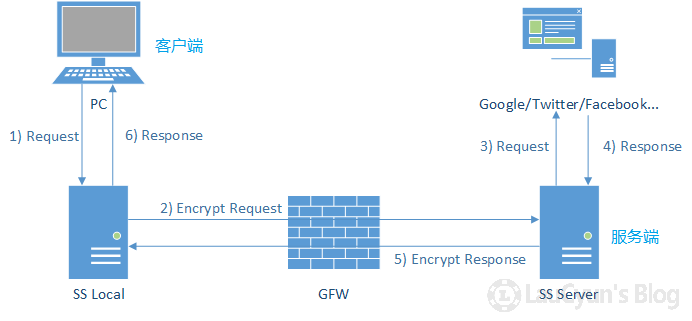
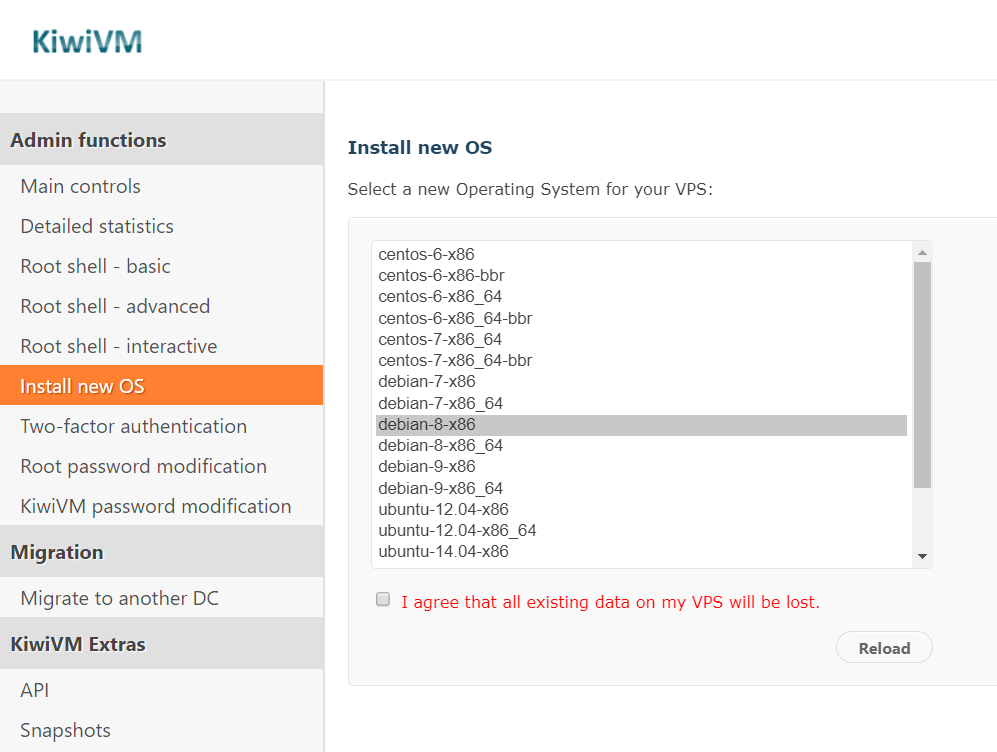
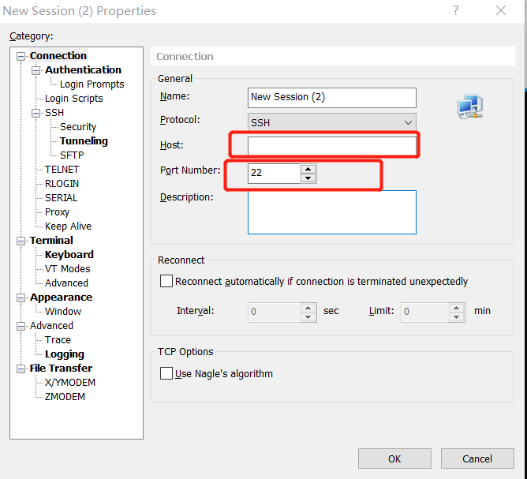
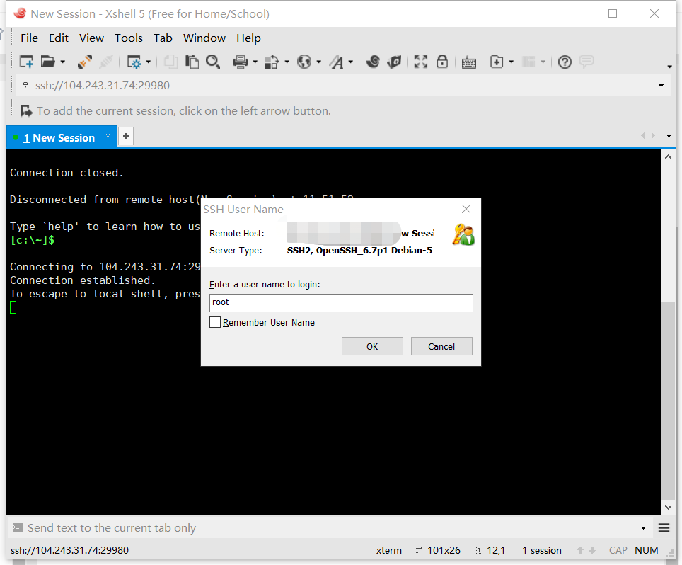
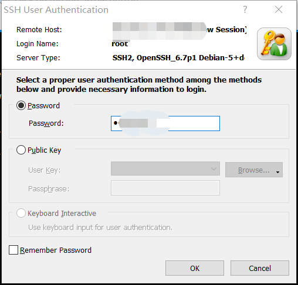
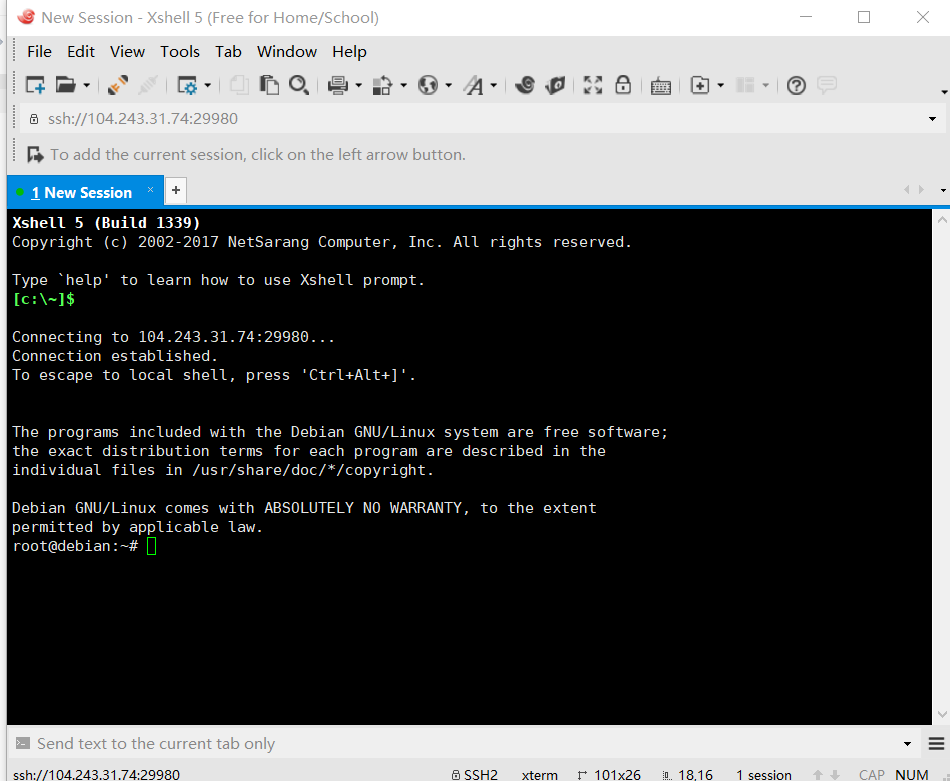

## 如何用shadowsocks-go搭建自己的VPN服务器
### - [****新手基本原理****](https://laucyun.com/5cce9d01b0a0210482d65f5bc040d83b.html)


---
## Practice

### Install new OS


点击Reload后
弹出的页面会显示 **远程登陆端口**和**root用户密码**并且**发送到指定邮箱**

### 通过xshell远程登陆 my VPS


Host: [IP地址 or 域名(域名还是会解析成IP地址)]

Prot Number: 远程登陆端口号

##### 点击 OK 远程连接到服务器的指定端口后
输入用户名和密码登陆(也就是邮箱收到的user name :root 及root的密码 )




### 登陆成功


---
- 更改密码
```
root@debian:~# passwd
```
- update更新


```
root@debian:~# apt-get update

```
- update  Kernel and pre-Loading TCP BBR
- 安装并开启BBR (更新内核并预加载TCP BBR算法模块,完成后重启。)


```
root@debian:~# wget --no-check-certificate -qO 'BBR.sh' 'https://moeclub.org/attachment/LinuxShell/BBR.sh' && chmod a+x BBR.sh && bash BBR.sh -f
Download New Kernel
	linux-image-4.12.9-041209-generic_4.12.9-041209.201708242344_i386.deb
Install New Kernel
	linux-image-4.12.9-041209-generic_4.12.9-041209.201708242344_i386.deb
Uninstall Old Kernel
	linux-image-3.16.0-4-686-pae
Uninstall Old Kernel
	linux-image-686-pae
pre-Loading TCP BBR ...
Finish! 
It will reboot now...
```
###### reboot重启后连接会断开，需要重新连接


- 魔改BBR


```
root@debian:~# wget --no-check-certificate -qO 'BBR_POWERED.sh' 'https://moeclub.org/attachment/LinuxShell/BBR_POWERED.sh' && chmod a+x BBR_POWERED.sh && bash BBR_POWERED.sh
Install make...
Install gcc...
Download Kernel Headers for All
	linux-headers-4.12.9-041209_4.12.9-041209.201708242344_all.deb
Install Kernel Headers for All
	linux-headers-4.12.9-041209_4.12.9-041209.201708242344_all.deb
Download Kernel Headers
	linux-headers-4.12.9-041209-generic_4.12.9-041209.201708242344_i386.deb
Install Kernel Headers
	linux-headers-4.12.9-041209-generic_4.12.9-041209.201708242344_i386.deb
Download BBR POWERED Source code
Loading TCP BBR POWERED...
Finish! 
root@debian:~# lsmod |grep 'bbr_powered'
tcp_bbr_powered        20480  0 
root@debian:~# wget --no-check-certificate -O shadowsocks-go.sh https://raw.githubusercontent.com/teddysun/shadowsocks_install/master/shadowsocks-go.sh
--2018-12-13 11:09:30--  https://raw.githubusercontent.com/teddysun/shadowsocks_install/master/shadowsocks-go.sh
Resolving raw.githubusercontent.com (raw.githubusercontent.com)... 151.101.196.133
Connecting to raw.githubusercontent.com (raw.githubusercontent.com)|151.101.196.133|:443... connected.
HTTP request sent, awaiting response... 200 OK
Length: 12977 (13K) [text/plain]
Saving to: ‘shadowsocks-go.sh’

shadowsocks-go.sh         100%[====================================>]  12.67K  --.-KB/s   in 0s     

2018-12-13 11:09:30 (26.3 MB/s) - ‘shadowsocks-go.sh’ saved [12977/12977]

root@debian:~# chmod +x shadowsocks-go.sh
root@debian:~# ./shadowsocks-go.sh 2>&1 | tee shadowsocks-go.log
```

- 获取并运行shadowsocks-go (go语言)
```
root@debian:~# wget --no-check-certificate -O shadowsocks-go.sh https://raw.githubusercontent.com/teddysun/shadowsocks_install/master/shadowsocks-go.sh
--2018-12-13 11:09:30--  https://raw.githubusercontent.com/teddysun/shadowsocks_install/master/shadowsocks-go.sh
Resolving raw.githubusercontent.com (raw.githubusercontent.com)... 151.101.196.133
Connecting to raw.githubusercontent.com (raw.githubusercontent.com)|151.101.196.133|:443... connected.
HTTP request sent, awaiting response... 200 OK
Length: 12977 (13K) [text/plain]
Saving to: ‘shadowsocks-go.sh’

shadowsocks-go.sh         100%[====================================>]  12.67K  --.-KB/s   in 0s     

2018-12-13 11:09:30 (26.3 MB/s) - ‘shadowsocks-go.sh’ saved [12977/12977]

root@debian:~# chmod +x shadowsocks-go.sh
root@debian:~# ./shadowsocks-go.sh 2>&1 | tee shadowsocks-go.log
```

- Shadowsocks Windows 使用说明 https://github.com/shadowsocks/shadowsocks-windows/wiki/Shadowsocks-Windows-%E4%BD%BF%E7%94%A8%E8%AF%B4%E6%98%8E
