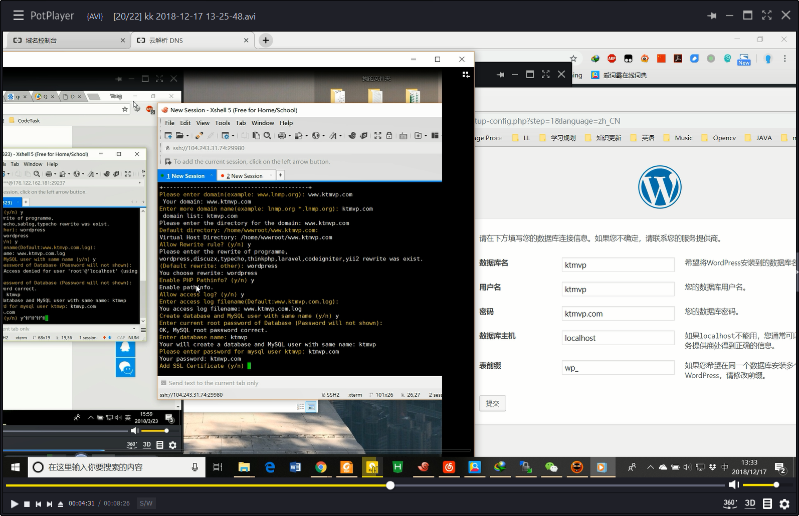

### LNMP添加、删除虚拟主机

---

LNMP添加、删除虚拟主机及伪静态使用教程

---
- [LNMP添加、删除虚拟主机及伪静态使用教程](https://lnmp.org/faq/lnmp-vhost-add-howto.html)
```
lnmp vhost add
```
- 域名解析
> 例如：阿里云购买了域名（ktmvp.com）. 在阿里云控制台，域名栏中，解析设置:解析服务器的IP地址
- 下载[wordpress](https://cn.wordpress.org/)包并且将wordpress/* 的文件解压到``/home/wwwroot/www.ktmvp.com/``下
```
root@debian:~# ls /home/wwwroot/www.ktmvp.com/
index.php		   wp-admin		 wp-cron.php	    wp-settings.php
license.txt		   wp-blog-header.php	 wp-includes	    wp-signup.php
readme.html		   wp-comments-post.php  wp-links-opml.php  wp-trackback.php
```
---
- 首次登陆wordpress


